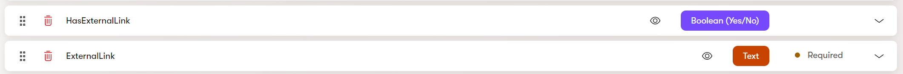
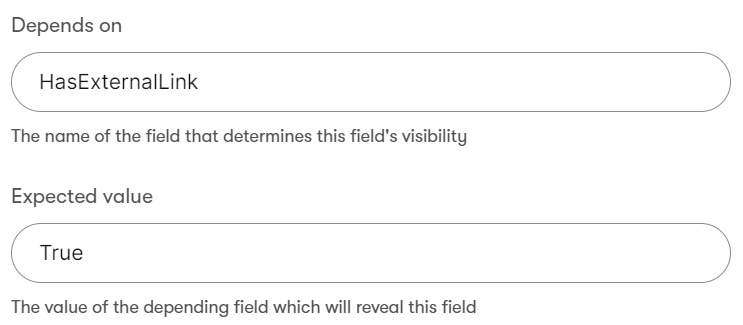

[](https://www.nuget.org/packages/Xperience.DependingFieldComponents#versions-body-tab)
[](https://github.com/kentico-ericd/xperience-depending-field-components/actions/workflows/build.yml)

# Xperience by Kentico depending field components

When editing content, often developers will want to hide a field's input based on the value of another field. For example, if an article _might_ contain a link to an external site, there will be a checkbox called "Has external link." If the checkbox is not checked, the text input for the external link should be hidden.

This project adds custom form components to Xperience by Kentico which allows developers to configure depending field functionality directly in the UI or code. These form components can be used in content types and widget properties.

## Compatibility

The following Xperience by Kentico versions have been tested and are supported by this project:

- 27.y.z
- 28.y.z

## Components

The project currently contains the following input types with depending field functionality:

- Text
- Number
- Checkbox
- Dropdown
- Date time
- Radio group

## Configuring depending fields in the administration

In the __Content types__ application, create two fields in which the visibility of one field depends on another field's value:



For the dependent field, choose a form component from this project, e.g. "Text input with field dependency." You will see two new properties that can be configured for the field:

- __Depends on__: The name of the field that determines this field's visibility
- __Expected value__: The value of the depending field which will reveal this field

Enter the name of another field in the content type, such as "HasExternalLink" in the above example. When that field's value changes, the current field's visibility will be reevaluated. In the expected value field, enter the string representation of the value required for the field to be shown. For example, if the field depends on a boolean field, the string representation of a checked box is "True."



## Configuring depending fields in code

> :warning: The following is redundant as the [default visibility attribute](https://docs.xperience.io/xp/developers-and-admins/customization/extend-the-administration-interface/ui-form-components/ui-form-component-visibility-conditions#UIformcomponentvisibilityconditions-Defaultvisibilityconditions) `VisibleIfEqualToAttribute` already offers the same functionality. However this will remain documented in the event that additional functionality is added in the future.

To configure depending widget properties, decorate the depending property with a form component attribute added by this project such as `TextInputDependsOnProperty`. Set the __DependsOn__ property to the name of another widget property, and __Expected value__ to the string representation of the value that will reveal this property.

In the following example, the text input will appear only if the checkbox is checked:

```cs
[CheckBoxComponent(Label = "Has target" , Order = 2)]
public bool HasTarget { get; set; }

[TextInputDependsOnProperty(DependsOn = nameof(HasTarget), ExpectedValue = "True", Label = "Button target", Order = 3)]
public string ButtonTarget { get; set; }
``````
